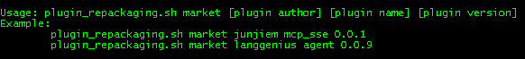
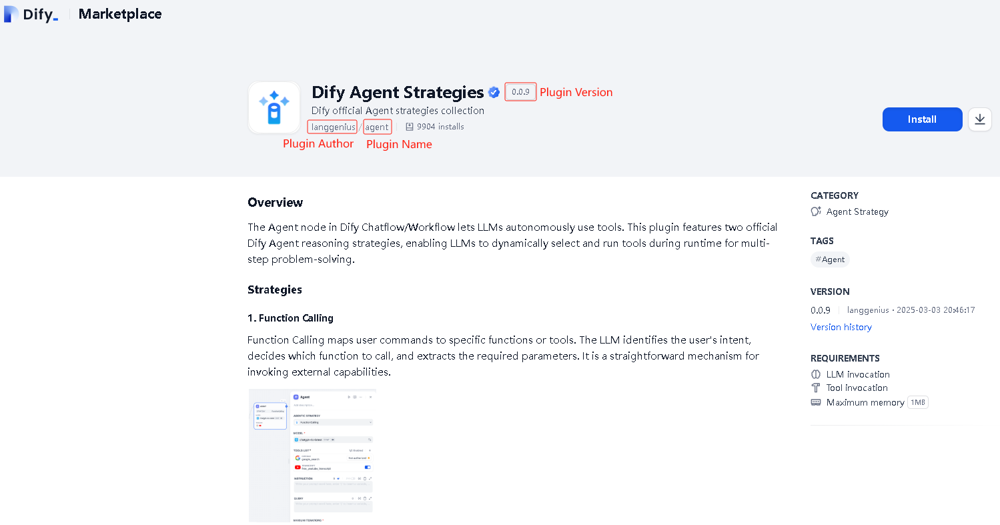
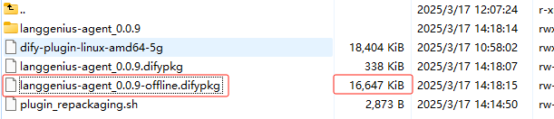
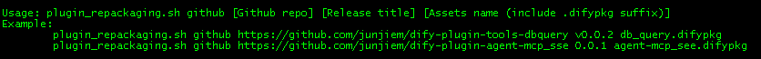
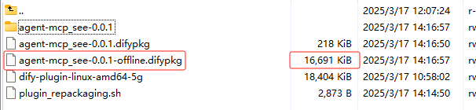
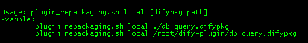
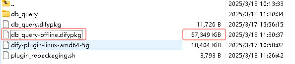
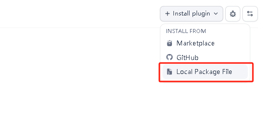

## Dify 1.0 Plugin Downloading and Repackaging


### Prerequisites

Operating System: Linux amd64

Requires Python Version 3.12+

#### Clone
```shell
git clone https://github.com/junjiem/dify-plugin-repackaging.git
```


### Description

#### From the Dify Marketplace downloading and repackaging



##### Example



```shell
./plugin_repackaging.sh market langgenius agent 0.0.9
```




#### From the Github downloading and repackaging



##### Example


```shell
./plugin_repackaging.sh github junjiem/dify-plugin-agent-mcp_sse 0.0.1 agent-mcp_see.difypkg
```




#### Local Dify package repackaging



##### Example

```shell
./plugin_repackaging.sh local ./db_query.difypkg
```




### Update Dify platform env  Dify平台放开限制

- your .env configuration file: Change `FORCE_VERIFYING_SIGNATURE` to `false` , the Dify platform will allow the installation of all plugins that are not listed in the Dify Marketplace.

- your .env configuration file: Change `PLUGIN_MAX_PACKAGE_SIZE` to `524288000` , and the Dify platform will allow the installation of plug-ins within 500M.

- your .env configuration file: Change `NGINX_CLIENT_MAX_BODY_SIZE` to `500M` , and the Nginx client will allow uploading content up to 500M in size.


- 在 .env 配置文件将 `FORCE_VERIFYING_SIGNATURE` 改为 `false` ，Dify 平台将允许安装所有未在 Dify Marketplace 上架（审核）的插件。

- 在 .env 配置文件将 `PLUGIN_MAX_PACKAGE_SIZE` 增大为 `524288000`，Dify 平台将允许安装 500M 大小以内的插件。

- 在 .env 配置文件将 `NGINX_CLIENT_MAX_BODY_SIZE` 增大为 `500M`，Nginx客户端将允许上传 500M 大小以内的内容。


### Installing Plugins via Local 通过本地安装插件

Visit the Dify platform's plugin management page, choose Local Package File to complete installation.

访问 Dify 平台的插件管理页，选择通过本地插件完成安装。



